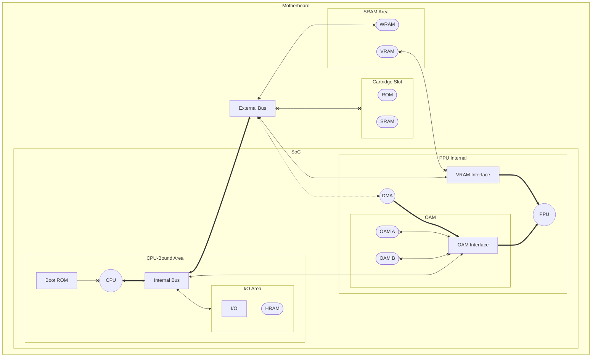

# Memory

The following is a detailed diagram of Game Boy's memory architecture [^sono].

<!-- Footnotes -->
[^sono]: Adapted from private communications with [Sono]. Used with permission.

<!-- Reference-style links -->
[sono]: https://github.com/SonoSooS
